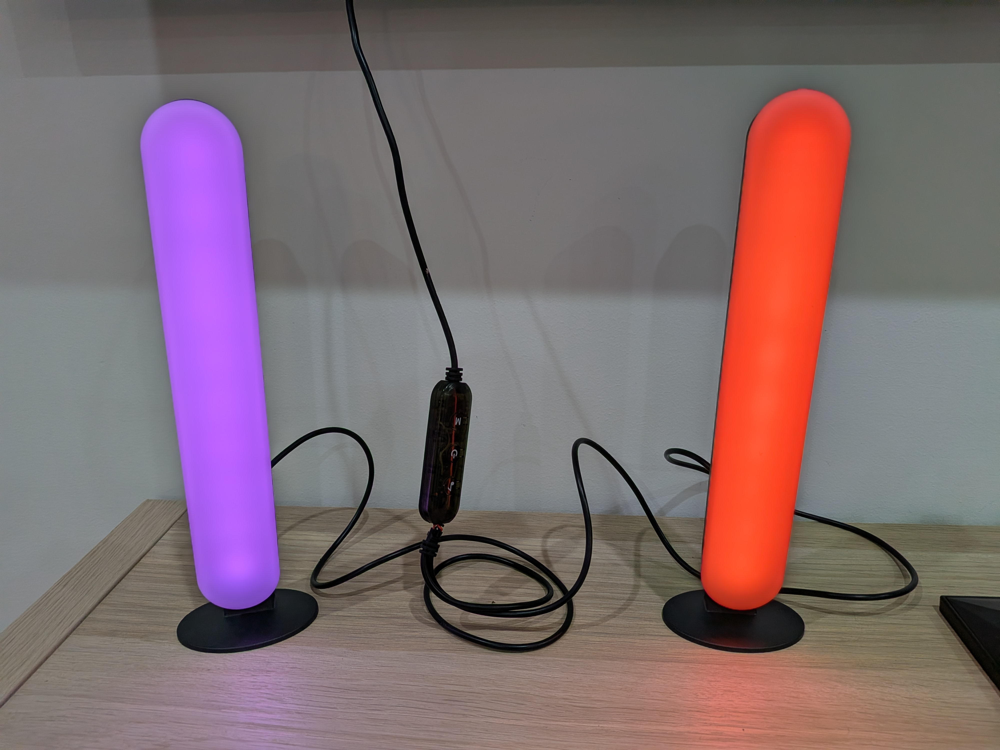
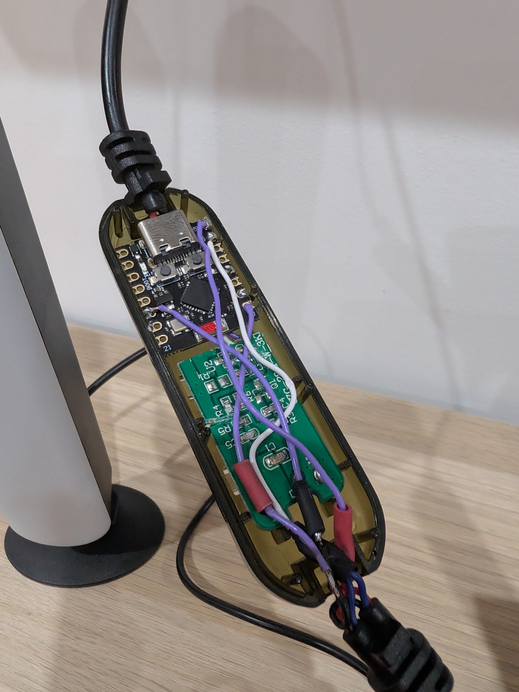
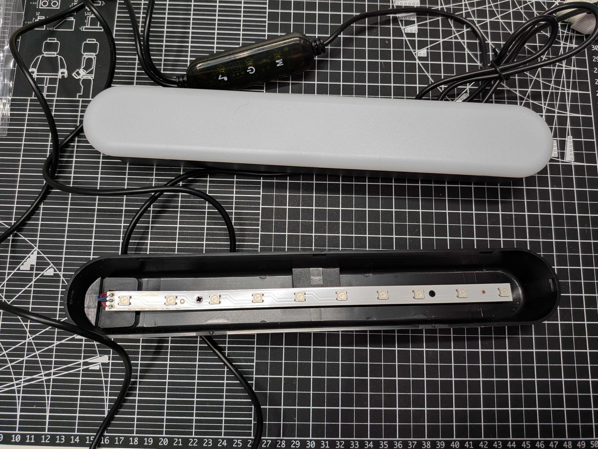

# Arlec Desk Light — ESPHome Smart Upgrade

Turn a dumb Arlec USB desk lamp into a fully smart, Home Assistant-controlled RGB light with physical buttons — using an ESP32-C3 Super Mini tucked inside.

> This project uses the [Arlec Black RGB Desk Lights Twin Pack](https://www.arlec.com.au/products/arlec-black-rgb-desk-lights-twin-pack), available at Bunnings.



---

## What this does

- Controls two independent addressable RGB LED strips via Home Assistant
- Two physical buttons report events to HA for custom automations (short press / long press)
- Fully local — no cloud, no Tuya, no subscriptions
- OTA firmware updates over WiFi
- Optional: control each LED individually for segment effects — [see below](#per-led-control-with-partitions)

---

## Parts list

| Part | Notes |
|------|-------|
| Arlec desk lamp | USB-powered, dual RGB strip |
| ESP32-C3 Super Mini | ~$3 on AliExpress |
| 2× momentary push buttons | NO (normally open) |
| Wire | For data lines and buttons |

The lamp's original controller board (CZG-2811-W-3KEY-SP) is bypassed entirely. I managed to cut the original board in such a way that the ESP32 fits in the original controller casing, and even reused the two physical buttons from the board — so the existing plastic buttons on the casing still work.



---

## How it works

The lamp's two LED strips are **WS2811-compatible addressable RGB strips** (marked `220×10MM-2835-10RGB`), powered by USB at 5V. The original music-reactive controller is removed and replaced with an ESP32-C3 Super Mini running ESPHome.

Each strip has 10 LEDs and is driven independently from a separate GPIO pin, using the NeoPixelBus library with explicit RMT channel assignment to avoid conflicts.



Two momentary buttons are wired to GPIO pins and report short/long press events to Home Assistant via the ESPHome native API.

---

## Wiring

```
USB 5V ──┬──► Strip 1 (+)
         ├──► Strip 2 (+)
         └──► ESP32-C3 5V pin

GND ─────┬──► Strip 1 (-)
         ├──► Strip 2 (-)
         └──► ESP32-C3 GND

GPIO0 ──────► Strip 1 data
GPIO10 ─────► Strip 2 data
GPIO3 ──────► Button 1 (other leg to GND)
GPIO1 ──────► Button 2 (other leg to GND)
```

> **Power note:** The ESP32-C3 and both strips are powered from the same USB-A cable that came with the lamp. A 2A charger is recommended. Never connect USB-A and USB-C simultaneously.

---

## Pin assignments

| Pin | Function | Notes |
|-----|----------|-------|
| GPIO0 | Strip 1 data | Safe pin |
| GPIO10 | Strip 2 data | Safe pin |
| GPIO3 | Button 1 | Safe pin, INPUT_PULLUP |
| GPIO1 | Button 2 | Safe pin, INPUT_PULLUP |
| GPIO8 | Onboard status LED | Active LOW |

---

## ESPHome configuration

See [`arlec.yaml`](arlec.yaml). You'll need a `secrets.yaml` with:

```yaml
wifi_ssid: "YourNetworkName"
wifi_password: "YourPassword"
ota_password: "choose-a-password"
ap_password: "choose-a-password"
api_key: "generate-with-python-see-below"
```

Generate an API key:
```bash
python3 -c "import secrets, base64; print(base64.b64encode(secrets.token_bytes(32)).decode())"
```

### Flashing

First flash via USB-C:
```bash
cd your-esphome-folder
esphome run arlec_desk_light.yaml
```

Subsequent updates can be done OTA from the ESPHome dashboard.

> **Important:** Make sure the LED strips are physically connected before flashing. The RMT peripheral will fail on boot with unconnected data pins.

---

## Key gotchas

- **Arduino framework required** — `neopixelbus` with explicit RMT channels only works with Arduino, not esp-idf
- **`output_power: 8.5dB`** — needed for stable WiFi with TP-Link mesh routers. Thanks to [Mark for that tip](https://www.facebook.com/share/p/1CxDNMGwco/)
- **Two RMT channels** — must be explicitly assigned (`channel: 0` and `channel: 1`) to drive two strips independently; without this the second strip fails silently
- **WS2811 variant** — the strips use a WS2811-compatible protocol despite the 2835 LED package markings; the original controller was labelled CZG-2811
- **GRB colour order** — not RGB; swap if colours appear wrong

---

## Home Assistant entities

Once added to HA, you get:

| Entity | Description |
|--------|-------------|
| `light.arlec_desk_lights_strip_1` | Strip 1 — full RGB + effects |
| `light.arlec_desk_lights_strip_2` | Strip 2 — full RGB + effects |
| `binary_sensor.arlec_desk_lights_button_sound` | Button 1 state |
| `binary_sensor.arlec_desk_lights_button_power` | Button 2 state |

### Button events

Automations can trigger on these events:

| Event | Trigger |
|-------|---------|
| `esphome.desk_button_sound_short` | Button 1 short press |
| `esphome.desk_button_sound_long` | Button 1 long press |
| `esphome.desk_button_power_short` | Button 2 short press |
| `esphome.desk_button_power_long` | Button 2 long press |

Example automation — long press power button toggles TV:

```yaml
alias: "Desk Button Power - Toggle TV"
trigger:
  - platform: event
    event_type: esphome.desk_button_power_long
action:
  - choose:
      - conditions:
          - condition: state
            entity_id: media_player.living_room_tv
            state:
              - "off"
              - "unavailable"
        sequence:
          - action: script.turn_on
            target:
              entity_id: script.living_room_tv_turn_on
      - conditions:
          - condition: state
            entity_id: media_player.living_room_tv
            state: "on"
        sequence:
          - action: media_player.turn_off
            target:
              entity_id: media_player.living_room_tv
```

---

## Demo — Follow TV app state

▶️ [Watch the demo (tv_auto.mov)](images/tv_auto.mov)

The strips can follow whatever is playing on your TV — matching the dominant colour of the current app or input. In this demo, the strips automatically change colour when switching between apps on the TV, giving the lamp a bias-lighting feel without any manual input.

This is implemented as a Home Assistant automation that watches `media_player.living_room_tv` state and attributes, and calls the ESPHome light service accordingly.

---

## Available effects

Both strips support these built-in ESPHome effects:
- Rainbow
- Color Wipe
- Scan
- Pulse

---

## Per-LED Control with Partitions


For more granular control, `arlec_desk_light_partition.yaml` splits each 10-LED strip into named segments — for example, top, middle, and bottom thirds. Each segment appears as its own light entity in Home Assistant, letting you set different colours or effects on different parts of the same physical strip.

This uses ESPHome's `partition` platform on top of a single underlying `neopixelbus` strip.

```yaml
light:
  - platform: neopixelbus
    id: all_leds
    internal: true
    type: GRB
    variant: WS2811
    pin: GPIO0
    num_leds: 10
    method:
      type: esp32_rmt
      channel: 0

  - platform: partition
    name: "Strip 1 Top"
    segments:
      - id: all_leds
        from: 0
        to: 2

  - platform: partition
    name: "Strip 1 Middle"
    segments:
      - id: all_leds
        from: 3
        to: 6

  - platform: partition
    name: "Strip 1 Bottom"
    segments:
      - id: all_leds
        from: 7
        to: 9
```

This gives you three independently controllable light entities from one strip — useful for showing status information, alerts, or ambient effects on different parts of the lamp.

---

## Credits

This project was inspired by Simone Luconi's [SKAFTSARV-to-WLED](https://github.com/simoneluconi/SKAFTSARV-to-WLED) — a similar "turn a dumb lamp smart" hack on an IKEA light. Cheers, Simone!

---

## License

MIT
